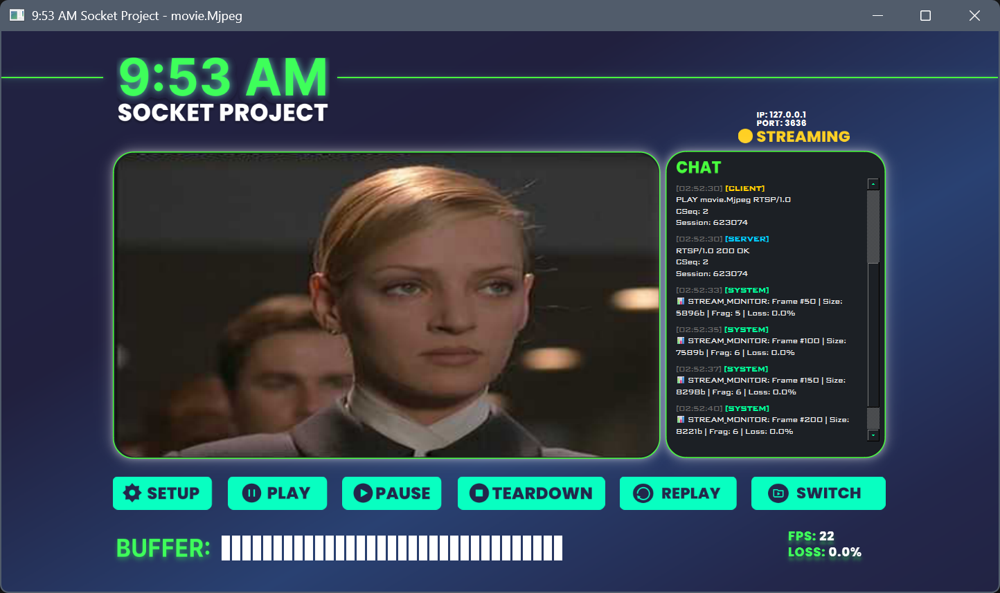

# 9:53 AM Socket Project - Advanced Video Streaming Application 🚀


## 📖 Introduction

**9:53 AM Socket Project** is a sophisticated Video Streaming application developed as a capstone project for the **Computer Networks** course (Class 24CTT6) at **VNU-HCM University of Science (HCMUS)**.

Under the mentorship of Lecturer **Le Ha Minh**, this project implements the **Real Time Streaming Protocol (RTSP)** for control and **Real-time Transport Protocol (RTP)** for data transmission. It goes beyond basic requirements by featuring a high-performance **Cyberpunk-themed GUI**, advanced **Packet Fragmentation** for HD video, and robust **Jitter Buffering**.

---

## 👥 Contributors

| Role | Member | Responsibilities |
| :--- | :---: | :--- |
| **Team Leader & Frontend** | <a href="https://github.com/cpgod36"><br /><sub><b>Phan Chí Cao</b></sub></a> | UI/UX, PyQt6 Implementation, Responsive Layout, Visual Effects, System Integration. |
| **Backend & Core Logic** | <a href="https://github.com/nh996"><br /><sub><b>Nguyễn Hoàng Nhật</b></sub></a> | RTSP/RTP Protocol Implementation, Packet Fragmentation, Jitter Buffer Logic, Multi-threading. |
---

## 🌟 Key Features

### 1. 🎨 Modern User Interface (Frontend)
*   **Cyberpunk Aesthetics:** A visually stunning interface with neon glowing effects, custom SVG icons, and a dark-themed palette.
*   **Responsive Design:** The application window maintains a strict **16:9 aspect ratio** and dynamically adapts all elements (buttons, video frame, text) when resized.
*   **Real-time Dashboard:** Displays live network statistics including **FPS**, **Packet Loss %**, and a dynamic **Buffer Health Bar**.
*   **Interactive Log:** A matrix-style chat log that visualizes the RTSP handshake process and stream status (System/Client/Server messages).

### 2. ⚡ Robust Core Logic (Backend)
*   **HD Streaming Support:** Implemented an intelligent **Fragmentation algorithm** to split large HD video frames (>100KB) into small UDP packets (~1.4KB) to fit within the network MTU, and reassemble them at the client side.
*   **Smart Jitter Buffer:** A circular buffer system that pre-loads frames to prevent stuttering. Includes **Auto-Rebuffering** logic (similar to YouTube/Netflix) when the network lags.
*   **Session Management:** Supports **Replay**, **File Switching**, and **Auto-reconnect** without restarting the application.

---

## 🛠 Tech Stack

*   **Language:** Python 3.x
*   **GUI Framework:** PyQt6
*   **Networking:** Python `socket` (TCP/UDP), `threading`
*   **Image Processing:** Pillow (PIL), OpenCV (for video conversion)

---

## 📸 Screenshots


---

## 🚀 Installation & Usage

### 1. Clone the Repository
```bash
git clone https://github.com/cpgod36/9.53-AM-Socket-Project.git
cd 9.53_AM_Socket_Project
```
### 2. Install Dependencies
Make sure you have Python installed. Then run:
```bash
pip install -r requirements.txt
```
### 3. Prepare Video (Optional)
The project requires MJPEG files with a specific header format. If you want to use your own .mp4 file:
```bash
# Convert your mp4 to the project's MJPEG format
python converter.py
The converted file will be saved in assets/video/.
```
### 4. Running the Application
You need to open two separate terminal windows.

**Step 1:** Start the Server
The server listens for incoming RTSP connections.
```bash
# Syntax: python -m src.server.server_main <PORT>
python -m src.server.server_main 3636
```
**Step 2:** Start the Client
Open a new terminal to launch the GUI.
```bash
# Syntax: python -m src.client.client_launcher <Server_IP> <Server_Port> <RTP_Port> <Video_File>
python -m src.client.client_launcher 127.0.0.1 3636 25000 movie_hd.Mjpeg
```
## 📂 Project Structure
```bash
9.53_SOCKET_PROJECT/
│
├── assets/                  # Project Resources
│   ├── fonts/               # Custom Fonts
│   ├── ui_design/           # Design Prototypes / Screenshots
│   ├── ui_packs/            # SVG Assets for GUI (Buttons, Icons, Backgrounds)
│   └── video/               # MJPEG Video Files for streaming
│
├── docs/                    # Project Documentation & Report
│
├── src/                     # Source Code
│   ├── client/              # Client-side Logic
│   │
│   ├── server/              # Server-side Logic
│   │
│   └── common/              # Shared Utilities
└── converter.py             # Tool to convert MP4/AVI to MJPEG format
```
---
### 📝 License
**This project is created for educational purposes.**